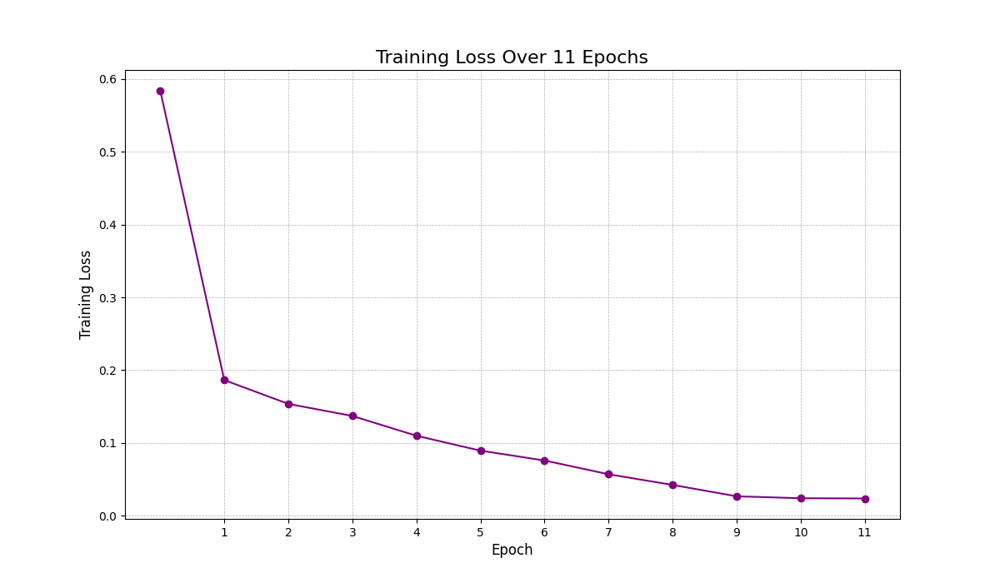

# Emotion-Based Music Recommender System 🎵

This project is an AI-powered application that detects a user's emotion from their text input and recommends a 5-song playlist from Spotify to match their mood.

# 🚀 Features

*Emotion Detection: Uses a fine-tuned `DistilRoBERTa` model to classify text into one of 6 emotions (Joy, Sadness, Anger, Love, Fear, Surprise).
*Music Recommender: A rule-based system that filters a music database based on audio features like `valence` and `energy` to match the detected emotion.
*Web UI: A clean, interactive, and user-friendly interface built with Gradio.

# 🤖 Model & Performance

The emotion detection model is a `DistilRoBERTa` model that was fine-tuned for 11 epochs on a preprocessed dataset.

*Final Test Accuracy: 93.30%

This accuracy was achieved on the `preprocessed_test.csv` dataset, proving the model is highly effective at generalizing to new, unseen data.

# Training Loss
This graph shows the model's error rate decreasing as it learned over the 11 epochs.
*(This will automatically display your `training_loss_graph_11_epochs.png` image once it's in the same folder)

# ⚠️ Known Issues & Limitations

This project uses the 11-epoch model trained on the original, simple preprocessing. Because of this, the model has a known bug:

*The "Not" Bug: The preprocessing removes "stopwords," including negative words.
*Example: The input "I am not happy" is preprocessed to "happy."
*Result: The model will incorrectly predict *Joy*.

This was a key finding during development, and a "SMART" model was built to fix it, but this version uses the original 93.30% accurate model.
